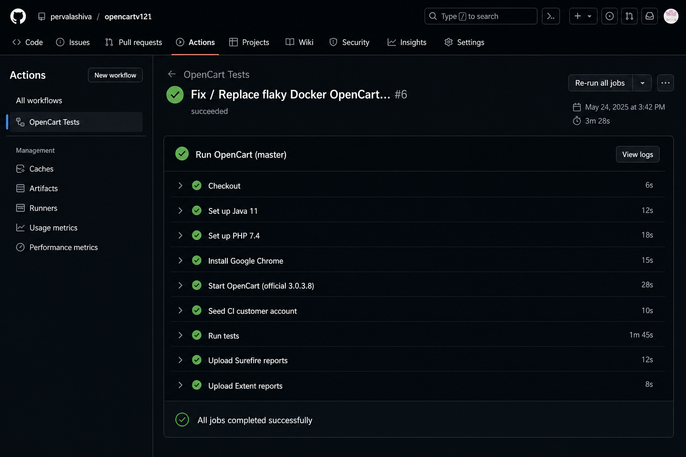

# OpenCart v1.21 — Selenium TestNG Automation

Java Selenium automation for [OpenCart](https://www.opencart.com/) storefront flows (account registration, login, and Excel-driven login DDT), with **ExtentReports** and **GitHub Actions** CI.

**Repository:** [pervalashiva/opencartv121](https://github.com/pervalashiva/opencartv121)

---

## Tech stack

| Piece | Choice |
|--------|--------|
| Language | Java 11 |
| Build | Maven |
| Test framework | TestNG |
| Browser automation | Selenium WebDriver 4 |
| Reporting | ExtentReports + Surefire |
| Test data | Apache POI (Excel) |
| CI | GitHub Actions (Ubuntu) |

---

## Project structure

```
opencartv121/
├── .github/workflows/opencart-tests.yml   # CI pipeline
├── scripts/ci-start-opencart.sh           # Installs official OpenCart for CI
├── master.xml / grouping.xml / seed.xml   # TestNG suites
├── testData/Opencart_LoginData.xlsx       # DDT login data
├── src/test/java/
│   ├── TestBase/BaseClass.java            # Driver + config
│   ├── pageObjects/                       # Page Object Model
│   ├── testCases/                         # TC001–TC003 (+ CI seed)
│   └── utilities/                         # Excel, Extent listener
└── src/test/resources/config.properties   # App URL + credentials (local)
```

### Test cases

| Class | What it covers |
|--------|----------------|
| `TC001_AccountRegistrationTest` | Register a new customer |
| `TC002_LoginTest` | Login with config credentials |
| `TC003_LoginDDT` | Login data-driven (Valid / Invalid from Excel) |
| `CISeedCustomer` | CI-only: creates the shared customer for login/DDT |

Default suite (`master.xml`) runs **TC001 + TC002 + TC003**.

---

## Run locally

### Prerequisites

- JDK 11+
- Maven 3.9+
- Google Chrome

### Config

Edit `src/test/resources/config.properties`:

```properties
execution_env = local
appURL1 = https://tutorialsninja.com/demo/index.php?route=common/home
email = your.email@example.com
password = yourpassword
```

### Commands

```bash
# Full master suite (Chrome, headed by default)
./run-tests.sh

# Or
mvn test -B -Dsurefire.suiteXmlFiles=master.xml

# Grouped suite
mvn test -Dsurefire.suiteXmlFiles=grouping.xml

# Headless
HEADLESS=true mvn test -Dsurefire.suiteXmlFiles=master.xml
```

Reports:

- Extent HTML → `reports/`
- Surefire → `target/surefire-reports/`
- Failure screenshots → `screenshots/`

---

## GitHub Actions

Workflow file: [`.github/workflows/opencart-tests.yml`](.github/workflows/opencart-tests.yml)

### Why CI uses a local OpenCart

[tutorialsninja.com](https://tutorialsninja.com/demo/) is behind **Cloudflare** and blocks GitHub-hosted runners (`One moment, please...`).  
CI therefore:

1. Starts **MySQL 5.7** as a service  
2. Downloads **official OpenCart 3.0.3.8**  
3. Runs **CLI install** (`scripts/ci-start-opencart.sh`)  
4. Serves the store on `http://127.0.0.1:8080/`  
5. Seeds a CI customer, then runs the TestNG suite headless  

### Triggers

- Push / PR to `main` or `master`
- Manual **workflow_dispatch** (suite: `master` / `grouping` / `cross-browser`, optional headed)

### Job steps (high level)

1. Checkout  
2. Java 11 + PHP 7.4 + Chrome  
3. Start OpenCart (official zip + MySQL)  
4. Seed CI customer (`seed.xml`)  
5. Run selected suite  
6. Upload Surefire, Extent, and screenshot artifacts  

### Successful run

Latest green run on `master` (commit `3427dd1`):

**https://github.com/pervalashiva/opencartv121/actions/runs/30243700478**

Surefire result from that run:

```text
Tests run: 7, Failures: 0, Errors: 0, Skipped: 0, Time elapsed: 40.38 s
```



Artifacts from each run (Actions → run → Artifacts):

- `surefire-reports-*`
- `extent-reports-*`
- `screenshots-*` (on failures)

### Manual workflow run

1. Open [Actions → OpenCart Tests](https://github.com/pervalashiva/opencartv121/actions/workflows/opencart-tests.yml)  
2. **Run workflow**  
3. Choose suite (`master` recommended)  
4. Download report artifacts when finished  

---

## Page Object Model

Tests use POM classes under `pageObjects/`:

- `HomePage` — My Account / Register / Login  
- `LoginPage` — credentials + submit  
- `accountRegistrationPage` — registration form  
- `MyAccountPage` — post-login verification + logout  

`BaseClass` owns WebDriver lifecycle, config loading, screenshots, and CI overrides (`APP_URL`, `TEST_EMAIL`, `TEST_PASSWORD`, `HEADLESS`).

---

## Notes

- Local default target: TutorialsNinja demo (may vary by region / bot checks).  
- CI target: self-hosted OpenCart on localhost (stable, no Cloudflare).  
- Valid Excel login rows in CI are overridden to the seeded `TEST_EMAIL` / `TEST_PASSWORD`.  

---

## License

Personal / learning project — no license file included.
